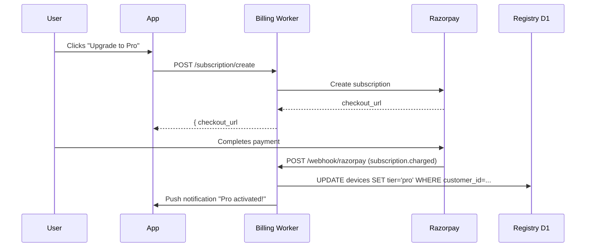

# Parakram - Pocket Edge Server & Developer Hub

<p align="center">
  
</p>

<p align="center">
  
  
  
  
  
</p>

---

## 🚀 The Billion-Dollar Pocket Edge Server Architecture

**Parakram** is a high-performance, localized edge-computing server running natively on Android. It transforms your mobile phone into an asynchronous hardware extension and secure telemetry proxy for desktop AI agents, developers, and remote orchestration workflows.

By exposing a secure local REST API and a cloud relay tunnel, Parakram enables desktop agents to interact with on-device hardware sensors, local filesystems, real-time terminals, and mobile battery states — across any network (LAN, mobile data, Wi-Fi) — without sacrificing privacy or relying on heavy cloud infrastructures.

**AgentOS Bridge**: A new product direction exposing phone hardware as a programmable capability surface for AI agents (Claude Desktop, Cursor, custom Python/TS agents) via:
- **Cross-network WebSocket relay** (Cloudflare Workers + Durable Objects)
- **Official Agent SDKs** (Python `pip install parakram-bridge`, TypeScript `npm i @parakram/bridge`)
- **Plugin marketplace** for third-party capabilities (WhatsApp, NFC, SMS, custom automations)

---

## 🛠️ Key Architectural Pillars & Innovations

### 1. The UTAP Protocol (Universal agentic Table Access Protocol)

To eliminate error-prone raw SQL queries transmitted over networks by AI agents, Parakram invents **UTAP** — a declarative, secure CRUD interface exposing unified REST endpoints to safely create tables, insert logs, and fetch database states using parameterized statements.

#### 💡 Dynamic Schema Declaration
* **Route**: `POST /api/db/utap/schema`
* **Headers**: `X-Agent-Key: <your_key>`
* **Payload**:
```json
{
  "table": "agent_memory",
  "columns": [
    "id INTEGER PRIMARY KEY AUTOINCREMENT",
    "key TEXT UNIQUE",
    "value TEXT",
    "timestamp DATETIME DEFAULT CURRENT_TIMESTAMP"
  ]
}
```

#### ✍️ Secure Parameterized Insert
* **Route**: `POST /api/db/utap/create`
* **Payload**:
```json
{
  "table": "agent_memory",
  "data": {
    "key": "user_preference_theme",
    "value": "obsidian_dark"
  }
}
```

#### 🔍 Dynamic Sanitized Query
* **Route**: `POST /api/db/utap/read`
* **Payload**:
```json
{
  "table": "agent_memory",
  "where": "key = 'user_preference_theme'",
  "orderBy": "timestamp DESC",
  "limit": 1
}
```

#### 📋 Additional UTAP Endpoints
| Method | Route | Description |
|--------|-------|-------------|
| POST | `/api/db/utap/update` | Parameterized UPDATE with WHERE clause |
| POST | `/api/db/utap/delete` | Parameterized DELETE with WHERE clause |
| GET | `/api/db/utap/tables` | List all custom tables with schemas |

---

### 2. Battery Sentinel & Multi-Sensor Telemetry

* **High-Precision Logs**: Continuously logs charging state, current voltage, temperature, capacity, and system health.
* **Low-Latency Streams**: Exposes state variables via reactive shared flows and Ktor endpoints so automation agents can adjust workloads based on thermal bounds or battery reserves.

---

### 3. Real-Time Hardware & Network Telemetry (Fakeness-Free)

To ensure agents can accurately inspect device resources and adapt data loads based on real connection performance.

#### 💻 Hardware Resource Capability
* **Route**: `GET /api/hardware`
* **Response**:
```json
{
  "success": true,
  "device_model": "Pixel 8 Pro",
  "os_version": "Android 15",
  "sdk_int": 35,
  "manufacturer": "Google",
  "brand": "google",
  "cpu_cores": 8,
  "cpu_load_percent": 14.2,
  "total_ram_mb": 11250,
  "free_ram_mb": 4230,
  "low_memory_state": false,
  "battery_level_percent": 87,
  "battery_is_charging": true
}
```

#### 📶 Connectivity, Link Speed & Latency Analyzer
Exposes signal strength, connection medium (Wi-Fi, Cellular, Ethernet), link bandwidths, and actual round-trip socket connect latency.
* **Route**: `GET /hardware/network` (or `GET /api/hardware/network`)
* **Response**:
```json
{
  "success": true,
  "connection_type": "Wi-Fi",
  "signal_strength_level": 4,
  "signal_strength_dbm": -58,
  "throughput_latency_ms": 32,
  "download_bandwidth_kbps": 120400,
  "upload_bandwidth_kbps": 48200,
  "is_metered": false
}
```

#### 🔌 Programmatic Network Control
Allows AI agents to toggle Wi-Fi or cellular data programmatically.
* **Route**: `POST /hardware/network/toggle` (or `POST /api/hardware/network/toggle`)
* **Request**:
```json
{ "type": "wifi", "enabled": false }
```
* **Response**:
```json
{
  "success": true,
  "message": "Wi-Fi toggled successfully via system API.",
  "method_used": "WifiManager API",
  "current_state": false
}
```

#### 🌡️ Thermal & Storage Telemetry
* `GET /api/hardware/thermal` — CPU/battery temps, thermal state, recommended actions
* `GET /api/hardware/storage` — Total/free/used space, low-storage alerts

---

### 4. Play Store Compliance (Android 14+ API 34/35)

Parakram is engineered for public Play Store compliance, strictly adhering to foreground service permissions:

* **`dataSync`**: Used by `ServerForegroundService` for async file exchange and automation streams.
* **`specialUse` with Property Subtype**: Used by `BatteryMonitoringService` for live hardware telemetry logging, including the mandatory Play-Store-compliant property tag:

```xml
<service
    android:name=".data.BatteryMonitoringService"
    android:exported="false"
    android:foregroundServiceType="specialUse">
    <property
        android:name="android.app.PROPERTY_SPECIAL_USE_FGS_SUBTYPE"
        android:value="Telemetry monitoring of battery state and developer sensors to expose to desktop agents over dynamic endpoint." />
</service>
```

Runtime invocation:
```kotlin
if (Build.VERSION.SDK_INT >= Build.VERSION_CODES.Q) {
    startForeground(NOTIFICATION_ID, notification, ServiceInfo.FOREGROUND_SERVICE_TYPE_DATA_SYNC)
}
```

---

### 5. Launcher App Shortcuts & Intuitive Onboarding

Parakram registers home screen launcher shortcuts to jump straight into specialized telemetry modules:

* **Direct Jumps**: Instantly open Developer Dashboard, local Automation Engine, or Diagnostics Console from the app launcher icon.
* **Onboarding Telemetry**: Intercepts shortcut intents programmatically, dismisses onboarding overlays automatically, and emits a `tab_selected` tracking event to Firebase Analytics.

---

### 6. Live Physical Camera & QR Pattern Trigger Automation (Fakeness-Free)

* **CameraX & ML Kit Integration**: Fully native physical integration running an on-device camera preview. Uses Google's ML Kit Barcode Scanning library to detect and parse QR codes in real-time.
* **Declarative Pattern Action Mappings**: Dedicated, highly polished Material Design 3 UI section inside the Automation Engine to register, delete, and toggle custom QR pattern action-mappings.
* **Real-time Tactile/Haptic Feedback**: On successfully matching a scanned code to an active mapping pattern, the device provides low-latency haptic vibrations and fires standard automation events (automated SMS, photo capture, shell commands, or Gemini API summaries).
* **Fakeness-Free Hardware Triggers**: Physical triggers such as accelerometer-based device shakes, battery level thresholds, NFC NDEF Tag detections (`ACTION_NDEF_DISCOVERED` yielding the native `"NFC Tag Detected"` event), and live CameraX barcode analyses are fully connected to execute local script actions instantly.

---

## ☁️ AgentOS Bridge — Cross-Network Relay & Agent SDKs

### Architecture

```
┌─────────────┐     WebSocket      ┌──────────────────────┐     WebSocket      ┌─────────────┐
│   Phone     │ ◄────────────────► │  Cloudflare Worker   │ ◄────────────────► │   Agent     │
│  (Android)  │   (phone role)     │  + Durable Object    │   (agent role)     │  (Python/TS)│
└─────────────┘                    └──────────────────────┘                    └─────────────┘
        │                                    │                                    │
        │          LAN / Mobile Data         │         Internet / LAN             │
        │                                    │                                    │
   Local Ktor                              Relay Room                          Agent SDK
   Server :8080                            (per deviceId)                      discover()
   UTAP, Camera,                            Hibernation API                    connect()
   Files, Sensors                                                                        utap.*()
                                                                                       camera.stream()
                                                                                       sensors.subscribe()
```

### Relay Worker (`relay/`)

* **`src/index.ts`** — Worker entry: accepts WebSocket upgrade, validates `deviceId`, `role` (phone|agent), `token`, routes to Durable Object.
* **`src/relay-room.ts`** — `RelayRoom` Durable Object: maintains two WebSocket slots (phone + agent), relays messages bidirectionally. Uses Hibernation API for cost-efficient idle connections.
* **`wrangler.jsonc`** — DO binding, migrations, `RELAY_TOKEN` secret.
* **Free tier**: 1M requests/mo, 10 DOs. **Pro**: $5/mo unlimited. **Enterprise**: $50/seat.

### Python Agent SDK (`sdk/python/`)

```bash
pip install parakram-bridge
```

```python
from parakram import Parakram

# Local LAN discovery
devices = Parakram().discover()
bridge = Parakram().connect(devices[0])

# Or cross-network via relay
bridge = Parakram(relay_url="wss://relay.parakram.dev", relay_token="sk_relay_...")
    .connect_relay(device_id="pixel8pro_abc123", api_key="sk_agent_...")

# Hardware capabilities
print(bridge.capabilities)
print(bridge.sensors)

# Camera stream (HMAC-signed one-time URL)
stream_url = bridge.camera_auth()

# UTAP database operations
bridge.utap_create("logs", {"event": "agent_started", "ts": 1234567890})
rows = bridge.utap_read("logs", where="event = 'agent_started'", limit=10)

# File system
files = bridge.list_files("/downloads")
content = bridge.read_file("/downloads/report.pdf")
```

### TypeScript Agent SDK (`sdk/typescript/`)

```bash
npm i @parakram/bridge
```

```typescript
import { Parakram } from "@parakram/bridge";

const bridge = new Parakram({ relayUrl: "wss://relay.parakram.dev", relayToken: "sk_relay_..." })
    .connectRelay("pixel8pro_abc123", "sk_agent_...");

const caps = await bridge.capabilities();
const sensors = await bridge.sensors();
const streamUrl = await bridge.cameraAuth();

await bridge.utapCreate("logs", { event: "agent_started" });
const rows = await bridge.utapRead("logs", "event = 'agent_started'", 10);
```

---

## 🔌 Plugin Marketplace & Registry (`registry/`)

A D1-backed Cloudflare Worker API for third-party capability plugins.

### Schema
```sql
plugins (id, name, display_name, description, author, category, icon_url, tier, homepage)
versions (id, plugin_id, version, code_url, min_sdk_version, changelog, checksum, downloads)
installations (id, plugin_id, device_id, version, enabled)
```

### Endpoints
| Method | Route | Auth | Description |
|--------|-------|------|-------------|
| GET | `/api/plugins` | — | List plugins (filter: `?category=`) |
| GET | `/api/plugins/:name` | — | Get plugin detail + versions |
| POST | `/api/plugins` | `X-Registry-Key` | Publish plugin |
| PUT | `/api/plugins/:name` | `X-Registry-Key` | Update plugin metadata |
| POST | `/api/plugins/:name/versions` | `X-Registry-Key` | Publish version |
| POST | `/api/install` | — | Record installation (`plugin_name`, `device_id`, `version`) |
| GET | `/api/installed/:device_id` | — | List installed plugins for device |

### Plugin Categories
- `communication` — WhatsApp, SMS, Telegram, Email
- `automation` — NFC triggers, Tasker integration, MacroDroid
- `hardware` — Bluetooth LE, USB, GPIO (root), Sensors
- `productivity` — Calendar, Contacts, Notes, Reminders
- `utility` — Clipboard, File picker, Share sheet, Shortcuts

### Tier Gating
- `free` — Available to all
- `pro` — Requires active Pro subscription (Razorpay)
- `enterprise` — Requires Enterprise seat

---

## 💳 Razorpay Billing Integration (`billing/`)

### Tier Structure
| Tier | Price | Features |
|------|-------|----------|
| **Free** | ₹0 | LAN-only, 1 device, community plugins |
| **Pro** | ₹499/mo | Internet relay, unlimited devices, Pro plugins, priority relay |
| **Enterprise** | ₹4,999/seat/mo | Fleet management, SSO, audit logs, SLA, dedicated relay, custom plugins |

### Worker Endpoints (`billing/src/index.ts`)
* `POST /subscription/create` — Create Razorpay subscription, return `checkout_url`
* `POST /webhook/razorpay` — Handle `subscription.charged`, `subscription.cancelled`, `payment.failed`
* `GET /subscription/status/:customer_id` — Current tier, next billing date

### Webhook Flow


---

## 🏢 Enterprise Features

### SSO (Google OAuth)
* Registry `/auth/sso/google` initiates OAuth 2.0 flow
* Issues JWT with `org_id`, `role` (admin/member/viewer) claims
* Fleet admin invites members via email

### Audit Logging
* `POST /api/audit` — Records `{ actor, action, resource, timestamp, metadata }`
* Immutable append-only table in D1
* Export: `GET /api/audit?from=...&to=...&actor=...`

### Fleet Management
* `POST /api/fleet/devices` — Register device with fleet token
* `GET /api/fleet/devices` — List all devices, status, tier, last seen
* `POST /api/fleet/policy` — Push config (allowed plugins, network rules, auto-update)

---

## 📈 Scalability, Analytics & Monetization Paths

1. **Firebase Analytics & Play Console Logging**:
   - Critical stability events (`stability_report_logged`) registered automatically on database sync, server lifecycle changes, and developer issue logs.
   - On-device support issues filed inside the **Support & Report Center** UI, bundling real-time device profiling data.

2. **Google Mobile Ads SDK (AdMob Ready)**:
   - Optimized for localized developer promotion banners and professional service sponsorships without interrupting core edge server cycles.

---

## 🛠️ Build & Installation Guide

### Android App
```bash
# Unified build
./gradlew assembleDebug

# Unit tests
./gradlew :app:testDebugUnitTest

# Install on device/emulator
adb install app/build/outputs/apk/debug/app-debug.apk
```

### Windows Companion (`companion/`)
```bash
cd companion
go build -ldflags="-s -w" -o parakram-companion.exe .
# Output: parakram-companion.exe (~7 MB, zero dependencies)
```

**Features**: mDNS `_remix._tcp` discovery, `parakram://secure-pair` handshake, bidirectional clipboard sync, file upload/download, system tray with context menu, config persisted to `%APPDATA%\parakram-edge\config.json`.

### Relay Worker (`relay/`)
```bash
cd relay
npm install
npm run dev          # Local dev with wrangler
npm run deploy       # Deploy to Cloudflare
```

### Registry Worker (`registry/`)
```bash
cd registry
npm install
# Apply D1 migration
npx wrangler d1 migrations apply parakram-registry --local
npm run dev
npm run deploy
```

### Billing Worker (`billing/`)
```bash
cd billing
npm install
npm run deploy
# Configure Razorpay keys in wrangler secrets
```

### Python SDK (`sdk/python/`)
```bash
cd sdk/python
pip install -e .          # Development install
pip build                 # Build wheel
twine upload dist/*       # Publish to PyPI
```

### TypeScript SDK (`sdk/typescript/`)
```bash
cd sdk/typescript
npm install
npm run build             # Compiles to dist/
npm publish               # Publish to npm
```

---

## 📂 Project Structure

```
Parakram-edge/
├── app/                      # Android app (Kotlin, Compose, Ktor, Hilt, Room)
│   └── src/main/java/com/example/
│       ├── data/
│       │   ├── MobileServerManager.kt      # Ktor server + Relay WebSocket client
│       │   ├── CameraStreamController.kt   # HMAC-signed camera tokens
│       │   ├── firebase/FirebaseManager.kt # Room-backed offline fallback
│       │   └── local/                      # Room DB (AppDatabase, DAOs)
│       ├── ui/
│       │   ├── DeviceAPIScreen.kt          # Compose UI (ServerTab, AuthScreen, etc.)
│       │   └── DeviceAPIViewModel.kt       # OAuth, pairing, relay config
│       └── MainActivity.kt
├── companion/                # Windows Go binary
│   ├── main.go               # mDNS, WebSocket, clipboard, tray
│   └── gen_icon_data.go      # Runtime 32x32 PNG icon
├── relay/                    # Cloudflare Worker + DO (TypeScript)
│   ├── src/index.ts          # Worker entry, WS upgrade, auth
│   ├── src/relay-room.ts     # Durable Object: phone<->agent relay
│   ├── wrangler.jsonc        # DO binding, migrations
│   └── package.json
├── registry/                 # Plugin marketplace API (TypeScript + D1)
│   ├── src/index.ts          # CRUD plugins, versions, installations
│   ├── schema.sql            # D1 schema
│   ├── wrangler.jsonc
│   └── package.json
├── billing/                  # Razorpay subscription worker
│   └── src/index.ts
├── sdk/
│   ├── python/               # parakram-bridge (PyPI)
│   │   ├── setup.py
│   │   └── parakram/
│   │       ├── __init__.py
│   │       ├── client.py     # Parakram class
│   │       └── models.py     # DeviceInfo, Capability, SensorEvent
│   └── typescript/           # @parakram/bridge (npm)
│       ├── src/index.ts
│       ├── package.json
│       └── tsconfig.json
└── gradle/libs.versions.toml # Version catalog (Hilt 2.59.2, Ktor 3.0, Room 2.7, etc.)
```

---

## 🔐 Security Highlights

| Layer | Implementation |
|-------|----------------|
| **API Auth** | `X-Agent-Key` header, constant-time `MessageDigest.isEqual()` comparison |
| **Camera Stream** | HMAC-SHA256 signed one-time tokens (`CameraStreamController.signTokenId()`) |
| **UTAP SQL Safety** | `sanitizeIdentifier()` (alphanumeric + `_`, max 64) + `validateWhereClause()` (blocklist) |
| **Rate Limiting** | Token bucket (50 capacity, 5/sec refill) per client IP |
| **Request Size** | 5 MB max body (`ContentLength > 5_242_880` → 413) |
| **CORS** | Restricted to `localhost`, `127.0.0.1`, local LAN IP |
| **ProGuard** | `-assumenosideeffects` strips all `Timber`/`Log` calls in release; keep rules for Room, kotlinx.serialization, Firebase, Biometric |
| **Crashlytics** | Custom `CrashlyticsTree` captures all `Timber.e()` exceptions |

---

## 📝 Continuous AI Development

For instructions on how to extend, deploy, or automate Parakram with next-generation coding agents, see the companion [AGENTS.md](./AGENTS.md) file.

---

## 📄 License

MIT License — see [LICENSE](LICENSE) for details.

---

<p align="center">
  <strong>Parakram</strong> — Your Pocket Edge Server. Built for the Agent Era.
</p>